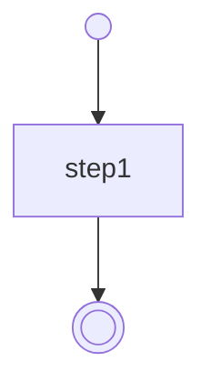

 [](https://gitpod.io/#https://github.com/serverlessworkflow/sdk-typescript)

- [Serverless Workflow Specification - TypeScript SDK](#serverless-workflow-specification---typescript-sdk)
  - [Status](#status)
  - [SDK Structure](#sdk-structure)
    - [Types and Interfaces](#types-and-interfaces)
    - [Classes](#classes)
    - [Fluent Builders](#fluent-builders)
    - [Validation Function](#validation-function)
    - [Other tools](#other-tools)
  - [Getting Started](#getting-started)
    - [Installation](#installation)
    - [Usage](#usage)
      - [Create a Workflow Definition from YAML or JSON](#create-a-workflow-definition-from-yaml-or-json)
      - [Create a Workflow Definition by Casting an Object](#create-a-workflow-definition-by-casting-an-object)
      - [Create a Workflow Definition Using a Class Constructor](#create-a-workflow-definition-using-a-class-constructor)
      - [Create a Workflow Definition Using the Builder API](#create-a-workflow-definition-using-the-builder-api)
      - [Serialize a Workflow Definition to YAML or JSON](#serialize-a-workflow-definition-to-yaml-or-json)
      - [Validate Workflow Definitions](#validate-workflow-definitions)
      - [Generate a directed graph](#generate-a-directed-graph)
      - [Generate a MermaidJS flowchart](#generate-a-mermaidjs-flowchart)
    - [Building Locally](#building-locally)

# Serverless Workflow Specification - TypeScript SDK

This SDK provides a TypeScript API for working with the [Serverless Workflow Specification](https://github.com/serverlessworkflow/specification).

With this SDK, you can:
* Parse workflow definitions in JSON and YAML formats
* Programmatically build workflow definitions
* Validate workflow definitions

## Status
The npm [`@serverlessworkflow/sdk`](https://www.npmjs.com/package/@serverlessworkflow/sdk) package versioning aligns with the versioning of the [specification](https://github.com/serverlessworkflow/specification):

| Latest Releases | Conformance to Spec Version |
| :---: | :---: |
| [v1.0.\*](https://github.com/serverlessworkflow/sdk-typescript/releases/) | [v1.0.0](https://github.com/serverlessworkflow/specification) |

> [!WARNING]
> Previous versions of the SDK were published with a typo in the scope:
> @severlessworkflow/sdk-typescript instead of
> @se**r**verlessworkflow/sdk-typescript

| Latest Releases | Conformance to Spec Version |
| :---: | :---: |
| [v1.0.0](https://github.com/serverlessworkflow/sdk-typescript/releases/) | [v0.6](https://github.com/serverlessworkflow/specification/tree/0.6.x) |
| [v2.0.0](https://github.com/serverlessworkflow/sdk-typescript/releases/) | [v0.7](https://github.com/serverlessworkflow/specification/tree/0.7.x) |
| [v3.0.0](https://github.com/serverlessworkflow/sdk-typescript/releases/) | [v0.8](https://github.com/serverlessworkflow/specification/tree/0.8.x) |

## SDK Structure
This SDK includes the following key components:

### Types and Interfaces
The SDK provides various TypeScript types and interfaces that ensure type safety and enhance the development experience by catching type errors during compile time.

To avoid confusion with classes, these types and interfaces are exported under the **`Specification`** object, e.g., `Specification.Workflow`.

### Classes
The SDK includes classes that correspond to the aforementioned types and interfaces. These classes offer:

- **Instance Checking**: Easily verify if an object is an instance of a specific class.
- **Self-Validation**: Validate the internal state of an object to ensure it adheres to the expected structure.
- **Normalization**: Methods to normalize object data, ensuring consistent formatting and values.

To avoid confusion with type definitions, these classes are exported under the **`Classes`** object, e.g., `Classes.Workflow`.

### Fluent Builders
The fluent builders wrap the core classes and provide a fluent API for constructing objects. This API allows you to chain method calls and configure objects in a more readable and convenient manner.

The fluent builders are directly exported as `*<desired-type>*Builder`, e.g., `workflowBuilder`.

By default, built objects are self-validated and self-normalized. `BuildOptions` can be passed to the `build()` method to disable validation or normalization.

### Validation Function
The SDK includes a validation function to check if objects conform to the expected schema. This function ensures that your workflow objects are correctly structured and meet the required specifications.

The `validate` function is directly exported and can be used as `validate('Workflow', workflowObject)`.

### Other Tools
The SDK also ships tools to build directed graph and MermaidJS flowcharts from a workflow.

## Getting Started

### Installation
> [!NOTE]
> Version v1.0.0.\* has not been released yet.

```sh
npm install @serverlessworkflow/sdk
```

### Usage
#### Create a Workflow Definition from YAML or JSON
You can deserialize a YAML or JSON representation of the workflow using the static method `Classes.Workflow.deserialize`:

```typescript
import { Classes } from '@serverlessworkflow/sdk';

// const text = await readFile('/some/path/my-workflow-definition.yaml', { encoding: 'utf8' });
// const text = await fetch('https://myserver.com/my-workflow-definition.json');
const text = `
document:
  dsl: 1.0.0
  name: test
  version: 1.0.0
  namespace: default
do:
- step1:
    set:
      variable: 'my first workflow'
`;
const workflowDefinition = Classes.Workflow.deserialize(text);
```

#### Create a Workflow Definition by Casting an Object
You can type-cast an object to match the structure of a workflow definition:

```typescript
import { Classes, Specification, validate } from '@serverlessworkflow/sdk';

// Simply cast an object:
const workflowDefinition = {
  document: {
    dsl: '1.0.0',
    name: 'test',
    version: '1.0.0',
    namespace: 'default',
  },
  do: [
    {
      step1: {
        set: {
          variable: 'my first workflow',
        },
      },
    },
  ],
} as Specification.Workflow;

// Validate it
try {
  validate('Workflow', workflowDefinition);
  // Serialize it
  const definitionTxt = Classes.Workflow.serialize(workflowDefinition);
}
catch (ex) {
  // Invalid workflow definition
}
```

#### Create a Workflow Definition Using a Class Constructor
You can create a workflow definition by calling a constructor:

```typescript
import { Classes, validate } from '@serverlessworkflow/sdk';

// Simply use the constructor
const workflowDefinition = new Classes.Workflow({
  document: {
    dsl: '1.0.0',
    name: 'test',
    version: '1.0.0',
    namespace: 'default',
  },
  do: [/*
    {
      step1: {
        set: {
          variable: 'my first workflow',
        },
      },
    },
  */],
});
workflowDefinition.do.push({
  step1: new Classes.SetTask({
    set: {
      variable: 'my first workflow',
    }
  })
});

// Validate it
try {
  workflowDefinition.validate();
  // Serialize it
  const definitionTxt = workflowDefinition.serialize();
}
catch (ex) {
  // Invalid workflow definition
}
```

#### Create a Workflow Definition Using the Builder API
You can use the fluent API to build a validated and normalized workflow definition:

```typescript
import { documentBuilder, setTaskBuilder, taskListBuilder, workflowBuilder } from '@serverlessworkflow/sdk';

const workflowDefinition = workflowBuilder(/*workflowDefinitionObject*/)
  .document(
    documentBuilder()
    .dsl('1.0.0')
    .name('test')
    .version('1.0.0')
    .namespace('default')
    .build()
  )
  .do(
    taskListBuilder()
      .push({
        step1: setTaskBuilder()
          .set({
            variable: 'my first workflow'
          })
          .build()
      })
      .build()
  )
  .build(/*{
    validate: false,
    normalize: false
  }*/);
```

#### Serialize a Workflow Definition to YAML or JSON
You can serialize a workflow definition either by using its `serialize` method if it's an instance or the static method with the same name:

```typescript
import { Classes } from '@serverlessworkflow/sdk';

// const workflowDefinition = <Your preferred method>;
if (workflowDefinition instanceof Classes.Workflow) {
  const yaml = workflowDefinition.serialize(/*'yaml' | 'json' */);
}
else {
  const json = Classes.Workflow.serialize(workflowDefinition, 'json');
}
```
> [!NOTE]
> The default serialization format is YAML.

#### Validate Workflow Definitions
Validation can be achieved in two ways: via the `validate` function or the instance `validate` method:

```typescript
import { Classes, validate } from '@serverlessworkflow/sdk';

const workflowDefinition = /* <Your preferred method> */;
try {
  if (workflowDefinition instanceof Classes.Workflow) {
    workflowDefinition.validate();
  }
  else {
    validate('Workflow', workflowDefinition);
  }
}
catch (ex) {
  // Workflow definition is invalid
}
```

#### Generate a directed graph
A [directed graph](https://en.wikipedia.org/wiki/Directed_graph) of a workflow can be generated using the `buildGraph` function:

```typescript
import { buildGraph } from '@serverlessworkflow/sdk';

const workflowDefinition = {
  document: {
    dsl: '1.0.0',
    name: 'using-plain-object',
    version: '1.0.0',
    namespace: 'default',
  },
  do: [
    {
      step1: {
        set: {
          variable: 'my first workflow',
        },
      },
    },
  ],
};
const graph = buildGraph(workflowDefinition);
/*{
  id: 'root',
  type: 'root',
  label: undefined,
  parent: null,
  nodes: [...], // length 3 - root entry node, step1 node, root exit node
  edges: [...], // length 2 - entry to step1, step1 to exit
  entryNode: {...}, // root entry node
  exitNode: {...} // root exit node
}*/
```

#### Generate a MermaidJS flowchart
Generating a [MermaidJS](https://mermaid.js.org/) flowchart can be achieved in two ways: using the `convertToMermaidCode` or the legacy `MermaidDiagram` class.

```typescript
import { convertToMermaidCode, MermaidDiagram } from '@serverlessworkflow/sdk';

const workflowDefinition = {
  document: {
    dsl: '1.0.0',
    name: 'using-plain-object',
    version: '1.0.0',
    namespace: 'default',
  },
  do: [
    {
      step1: {
        set: {
          variable: 'my first workflow',
        },
      },
    },
  ],
};
const mermaidCode = convertToMermaidCode(workflowDefinition) /* or new MermaidDiagram(workflowDefinition).sourceCode() */;
/*
flowchart TD
    root-entry-node(( ))
    root-exit-node((( )))
    /do/0/step1["step1"]
    /do/0/step1 --> root-exit-node
    root-entry-node --> /do/0/step1


classDef hidden display: none;
*/
```



### Building Locally

To build the project and run tests locally, use the following commands:

```sh
git clone https://github.com/serverlessworkflow/sdk-typescript.git
cd sdk-typescript
npm install && npm run build && npm run test
```

If you're interested in contributing, reading the [Tooling Architecture](/tools/README.md) is a good place to start.